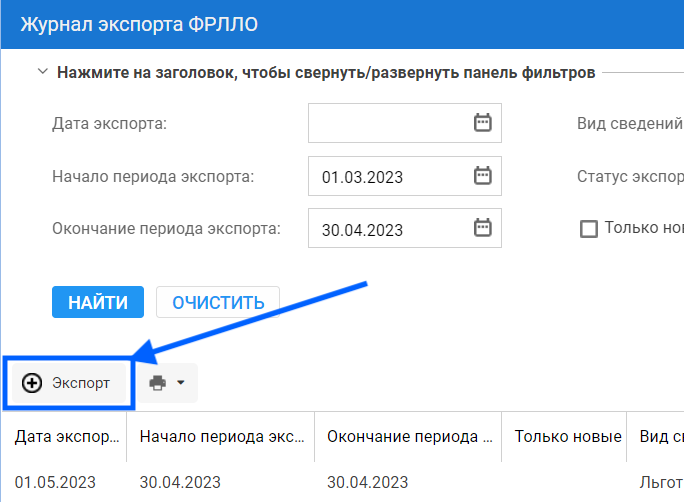

= Как сформировать и выгрузить сведения в ФРЛЛО

[IMPORTANT]
====
. Учетная запись пользователя должна быть включена в группу прав *Администратор ФРЛЛО*. 
. Формирование и выгрузка сведений в ФРЛЛО выполняется на форме *Журнал экспорта в ФРЛЛО*.
====

.Как открыть форму *Журнал экспорта ФРЛЛО*
[%collapsible]
=====
1. Авторизуйтесь в АРМ администратора ЦОД или АРМ специалиста ЛЛО ОУЗ.
2. Нажмите *ФРЛЛО* на боковой панели АРМ и выберите пункт *Журнал экспорта ФРЛЛО*.
=====

Для выгрузки сведений в ФРЛЛО:

1. Нажмите *Экспорт* на форме *Журнал экспорта ФРЛЛО*.
2. Заполните необходимые поля в открывшейся форме *Экспорт ФРЛЛО*:
* если установить флаг *Только новые*, то отбираются льготы с датой добавления, попадающей в период экспорта;
* если снять флаг *Только новые*, то отбираются льготы с датой редактирования, входящей в период экспорта;
* если установить флаг *Включить логирование запросов*, то:
** сохраняется ссылка на пациента и ссылка на льготу;
** в каждой записи лога указывается идентификатор документа, передаваемого в ФРЛЛОfootnote:[Идентификатор документа генерируется для каждой льготы, включаемой в документ.].
3. Нажмите *Экспорт*.

image::image/Export FRLLO.png[Форма «Экспорт ФРЛЛО»]

Запустится формирование xml-файла по указанным параметрам. Отобразится сообщение: «Запущен экспорт ФРЛЛО по указанным параметрам. Cформированный файл будет доступен для скачивания на форме "Журнал экспорта ФРЛЛО".».

== Просмотр результата экспорта

1. Нажмите *Обновить* в нижней части формы *Журнал экспорта ФРЛЛО* footnote:[Если в столбце *Статус экспорта* отобразится *Подготовлен файл экспорта*, значит файл выгрузки сформирован.].
2. Нажмите на ссылку в поле *Файл экспорта* необходимой записи об экспорте.

Файл сохранится на ПК.