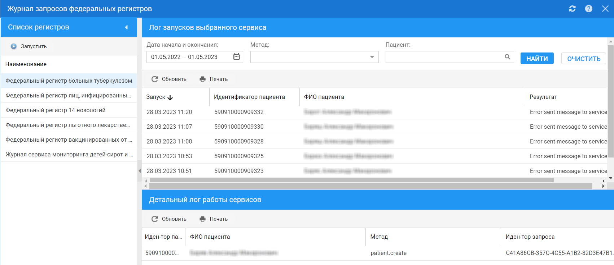

= Как просмотреть результаты взаимодействия с федеральными регистрами

Посмотреть результат взаимодействия Системы с федеральными регистрами можно на форме https://asciidoc.org[Журнал запросов федеральных регистров].

1. Выберите регистр в разделе *Список регистров*.
2. Заполните поля фильтров в разделе *Лог запусков выбранного сервиса*;
3. Нажмите *Найти*;
4. Выберите запись.

В разделе *Детальный лог работы сервисов* отобразится лог запуска сервиса для выбранной записи.